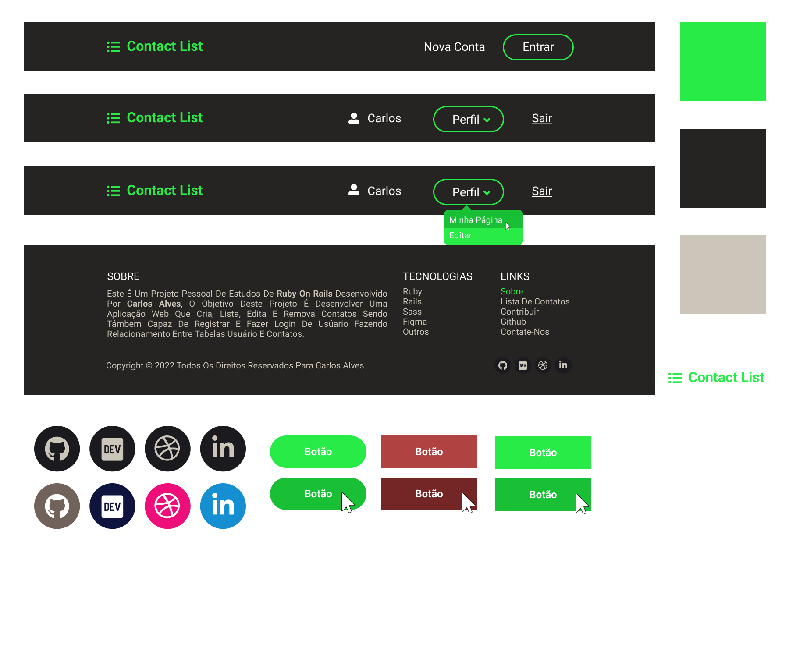
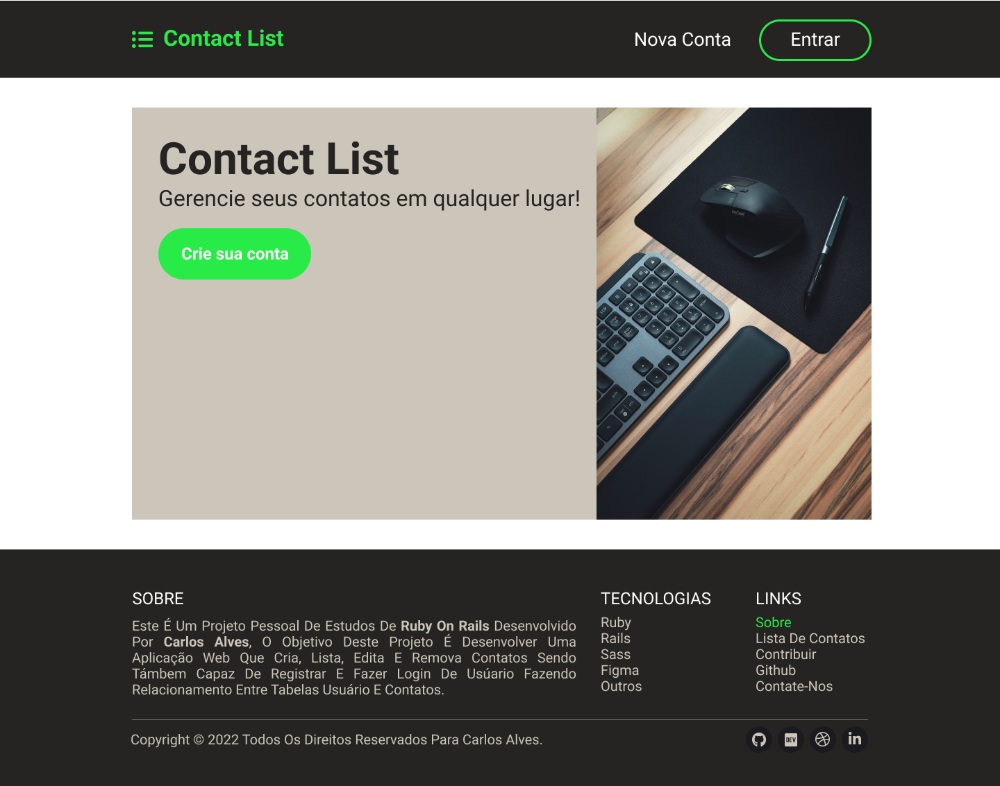
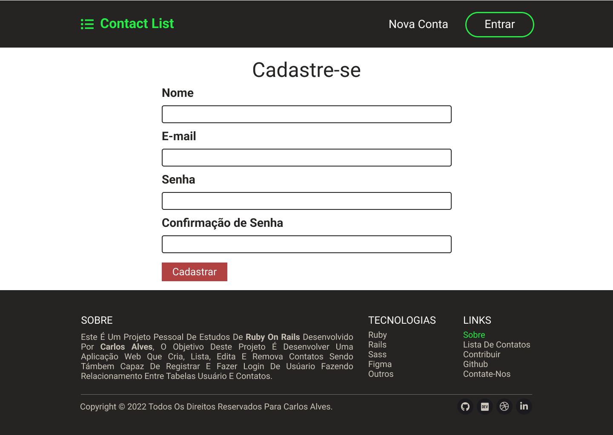
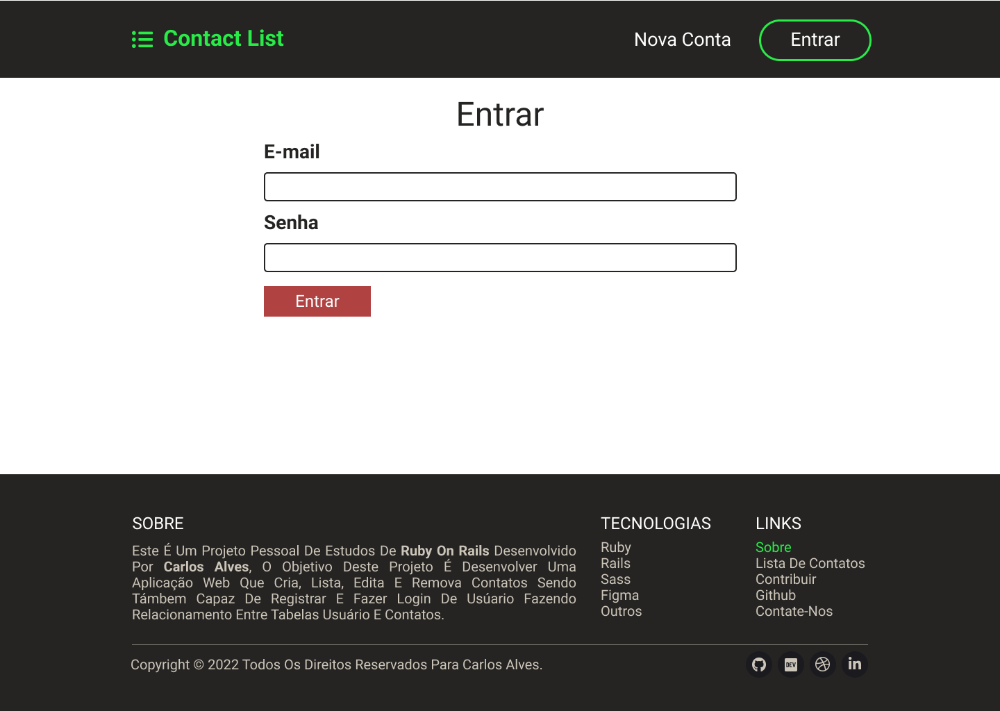
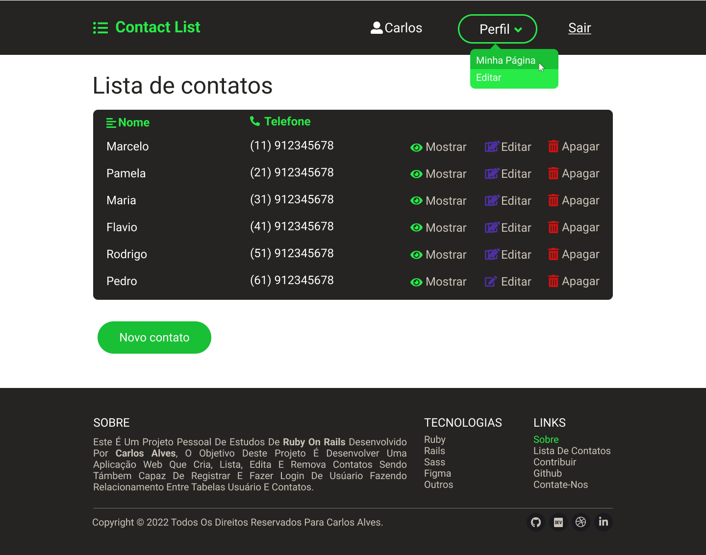
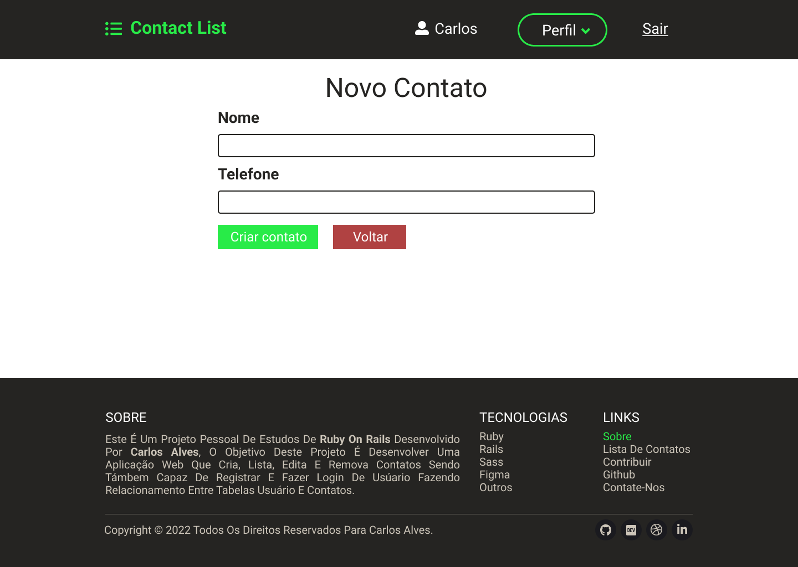

# 📱 Lista de Contatos

## Requisitos necessário:
* Ruby 2.7.3
* Rails 6.1.6
* SQLite 1.4

## Instalação:

Clone o repositório:
```bash
git clone https://github.com/EuCarlos/contact-list.git && cd contact-list
```

Instale as dependências usando Yarn ou NPM:

```bash
bundle install
```

## Configuração
Criação do banco de dados
```bash
rails db:create
```
Inicialização do banco de dados
```bash
rails db:migrate
```
## Rode o projeto
```bash
rails server
```
Abrir [http://localhost:3000](http://localhost:3000) com seu navegador para ver o resultado.

## Protótipo em figma
Para o desenvolvimento deste projeto, foi criado um protótipo em figma. Para baixar o arquivo figma, basta acessar: `./docs/design/ContactList.fig` ou [clique aqui](./docs/design/ContactList.fig).
## 1. Recursos


## 2. Página inicial


## 3. Página de Cadastro


## 4. Página de Login


## 5. Página de lista de contatos


## 6. Página de novos contatos


## 7. Página de editar perfil


## Rotas
| Prefixo | Verbo | Padrão URI | Controller#Action |
| :----: | :---:| :---------- | :---------------- |
| root | GET | `/` | `static_pages#index` |
| sobre | GET | `/sobre(.:format)` | `static_pages#sobre` |
| contato | GET | `/contato(.:format)`| `static_pages#contato` |
| entrar | GET | `/entrar(.:format)` | `sessions#new` |
|| POST  | `/entrar(.:format)` | `sessions#create` |
| sair | DELETE| `/sair(.:format)` | `sessions#destroy` |
| contacts | GET | `/contacts(.:format)`| `contacts#index` |
|| POST| `/contacts(.:format)`| `contacts#create` |
| new_contact | GET | `/contacts/new(.:format)`| `contacts#new` |
| edit_contact | GET | `/contacts/:id/edit(.:format)` | `contacts#edit` |
| contact | GET | `/contacts/:id(.:format)`| `contacts#show` |
|| PATCH | `/contacts/:id(.:format)`| `contacts#update` |
|| PUT | `/contacts/:id(.:format)`| `contacts#update` |
|| DELETE| `/contacts/:id(.:format)`| `contacts#destroy` |
| users | POST| `/users(.:format)`| `users#create` |
| new_user | GET | `/users/new(.:format)`|`users#new` |
| edit_user | GET | `/users/:id/edit(.:format)`| `users#edit` |
| user | GET | `/users/:id(.:format)`|`users#show` |
|| PATCH| `/users/:id(.:format)`|`users#update` |
|| PUT | `/users/:id(.:format)`|`users#update` |
| sessions | POST | `/sessions(.:format)`| `sessions#create` |
| new_session | GET | `/sessions/new(.:format)`| `sessions#new` |
| session | DELETE| `/sessions/:id(.:format)`| `sessions#destroy` |

</pre>

## Como contribuir para este projeto?
Antes de começar, verifique e siga as instruções para contribuir com o repositório. Se não, você pode seguir as instruções abaixo:

1. Fork o projeto
2. Crie um novo branch: git checkout -b nova-branch
3. Confirme suas alterações: git commit -m 'Adicionei algo'
4. Push to branch: git push origin nova-branch
5. Abra uma solicitação pull


## Como faço para relatar um bug ou solicitar um recurso?
Se você quiser relatar um bug ou solicitar um recurso, vá para [Issue](https://github.com/eucarlos/contact-list/issues) no projeto do GitHub e adicione sua solicitação.

___

<p align="center">
Criado com 💜 por <a href="https://github.com/eucarlos/">Carlos Alves</a>
</p>